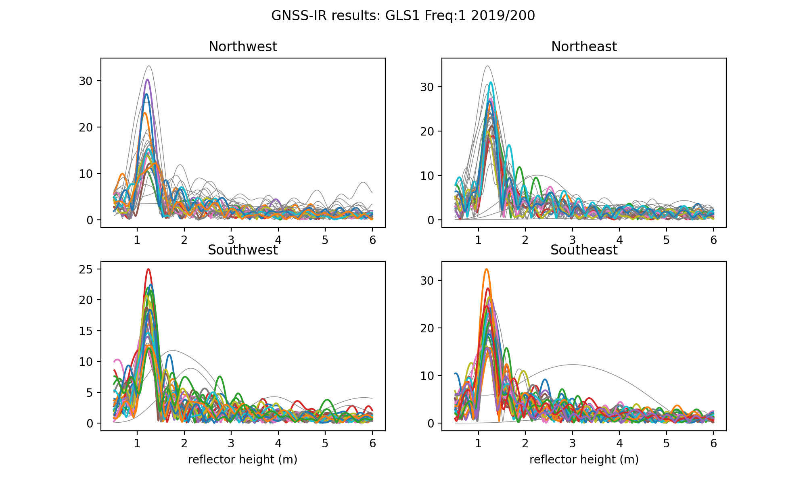

### Use case for Greenland Ice Sheet, Greenland

**Station Name:**		gls1

**Location:**  Greenland Ice Sheet in Qeqqata Province, Greenland

**Archive:**  UNAVCO, SOPAC

**DOI:**  doi.org/10.7283/T5WS8RDB

**Ellipsoidal Coordinate:**

- Latitude: 66.47940

- Longitude:  -46.31015

- Height:    2150 m

[Station Page at UNAVCO](https://www.unavco.org/instrumentation/networks/status/nota/overview/gls1)

[Station Page at Nevada Geodetic Laboratory](http://geodesy.unr.edu/NGLStationPages/stations/GLS1.sta)

Image source: IRIS/PASSCAL

## Data Summary

Station gls1 was installed as part of the Greenland Ice Sheet Monitoring Network and is operated by IRIS.  The station is mounted on a ~3.5 in the Greenland Ice Sheet.  The data are archived at UNAVCO and SOPAC.  The receiver at the site tracks only GPS signals.  A detailed discussion of data from the station can be found in 
this [open option paper](https://tc.copernicus.org/articles/14/1985/2020/tc-14-1985-2020.pdf). Position time series for gls1 can be retrieved from [Nevada Reno](http://geodesy.unr.edu/gps_timeseries/tenv3/IGS14/GLS1.tenv3)

## Web App

The GNSS-IR Web will give a sense of what the site looks like.  [The web app analyzes data in real-time, and will take ~5 seconds for the results to "pop" up](https://gnss-reflections.org/fancy6?example=gls1). The webapp provides you with a photograph, coordinates (make a note of them), and a google Earth map. Save the periodogram so you can look at it more closely.

**Setting Elevation and Azimuth Mask**
Consult [Reflection Zone Mapping in the Web App](https://gnss-reflections.org/rzones?station=gls1&lat=0.0&lon=0.0&height=0.0&msl=msl&RH=2&eang=1&azim1=0&azim2=360) for a sense of what azimuth or elevation masks to use.  Hint:  this site is on an ice sheet, flat in all directions.

## Reproduce the Web App

**Make SNR File**

First, make an SNR file 

*rinex2snr gls1 2019 200*

Or alternately:

*rinex2snr gls1 2019 200 -fortran False*

**Take a Quick Look at the Data**

Take a look at the spectral characteristics of the SNR data for the default L1 settings:

*quickLook gls1 2019 200*

The four subplots show you different regions around the antenna. The x-axis tells you reflector height (RH) and the y-axis gives you the spectral amplitude of the SNR data. The multiple colors are used to depict different satellites that rise or set over that section (quadrant) of the field at gls1. Which colors go to which satelliets is not super important. The goal of this exercise is to notice that the peaks of those periodograms are lining up around an x-value of just over 1 meter. You also see some skinnier gray data - and those are failed periodograms. This means that the code doesn't believe the results are relevant. I did not originally plot failed periodograms, but people asked for them, and I do think it is useful to see that there is some quality control being used in this code.

## Analyze the Data

This site was originally installed with an elevation mask of 7 degrees. Later it was changed. To keep things the 
same, I strongly prefer that the same elevation angle mask is used 
throughout. Meaning I am going to set the minimum elevation angle to 7 when setting up the json file containing the analysis paramters:

*make_json_input gls1 66.479 -46.310 2148.578 -h1 0.5 -h2 8 -e1 7 -e2 25*

The **make_json_input** defaults are to use all good GPS frequencies (1,20,5). 
However, the standard L2 data at gls1 are really not useful (and L2C was sometimes tracked and 
sometimes not tracked). L5 has never been tracked. Here it is better 
to simply use L1. Hand-edit the json file to remove L2C and L5. It should look [like this.](gls1.json)

Now make some SNR files for the year 2012:

*rinex2snr gls1 2012 1 -doy_end 365*

Look at the first one - make sure that the RH defaults are big enough to include the answer:

*quickLook gls1 2012 1 -e1 7 -e2 25*

Analyze all the 2012 data:

*gnssir gls1 2012 1 -doy_end 365*

Make a daily average (since you only have L1 at this site, I am requiring 30 tracks instead of 50)

*daily_avg gls1 0.25 30*

The plots:

That is what I call a lot of melt! If you want the reflector height values, set the requested txt 
output filename in **daily_avg**.

